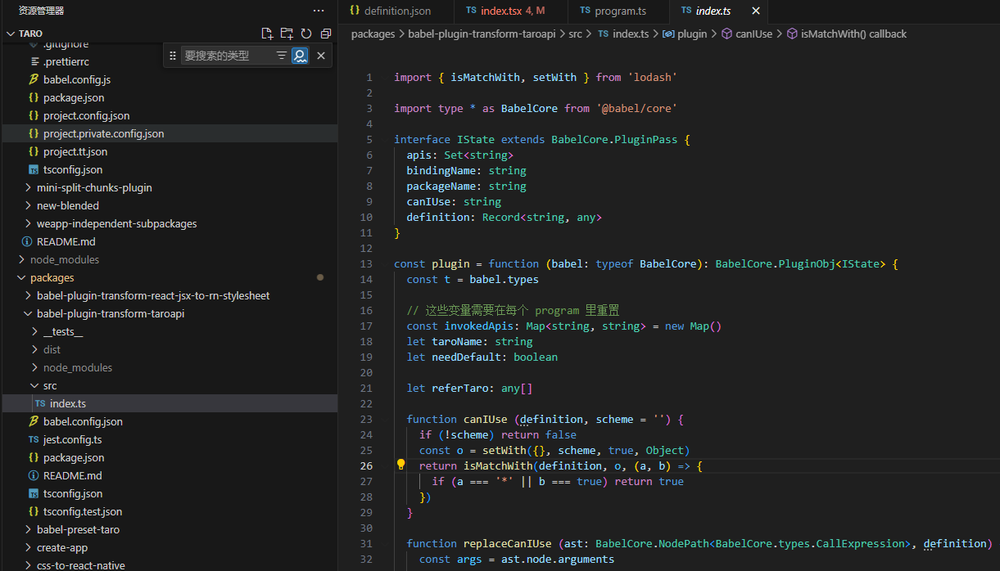

# canIUseDemo

## 简介
canIUse接口在使用字符串字面量传参时会用到babel-plugin-transform-taroapi插件，插件中的canIUse方法入参scheme即为canIUse字符串字面量传参，该方法对scheme处理时，会把其中的数字属性转为数组，导致后续isMatchWith函数返回false，预期需要的是true。

## babel-plugin-transform-taroapi插件修改前
对scheme入参处理使用的是lodash库中的set函数，例如在对入参为“live-pusher.audio-reverb-type.4”处理后，最后的数字属性“4”会被转为一个数组{'live-pusher': { 'audio-reverb-type': [ <4 empty items>, true]}}（如下截图），这导致后续isMatchWith函数在对比definition和scheme中属性时返回false，从而导致Taro.canIUse("live-pusher.audio-reverb-type.4")结果为false，与预期不符。

## babel-plugin-transform-taroapi插件修改后
修改后使用lodash库中的setWith方法，第四个参数传Object，此时不管入参scheme路径中是否带有数字属性，均会被转为对象，例如scheme为live-pusher.audio-reverb-type.4会被转为{'live-pusher': { 'audio-reverb-type': {'4': true}}}, 后续isMatchWith函数在对比definition和scheme中属性时返回true, 此时Taro.canIUse("live-pusher.audio-reverb-type.4")结果为true， 与预期一致。

## 修改后的验证结果

### 用例

### 结果

